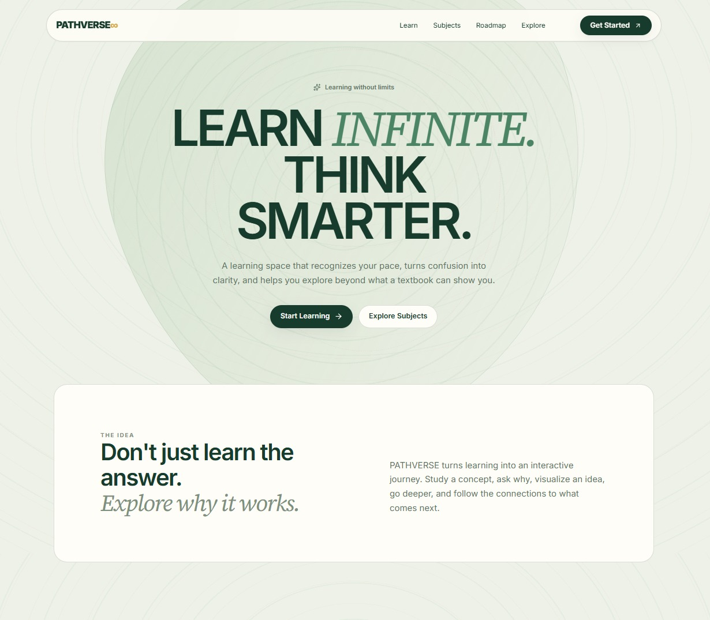
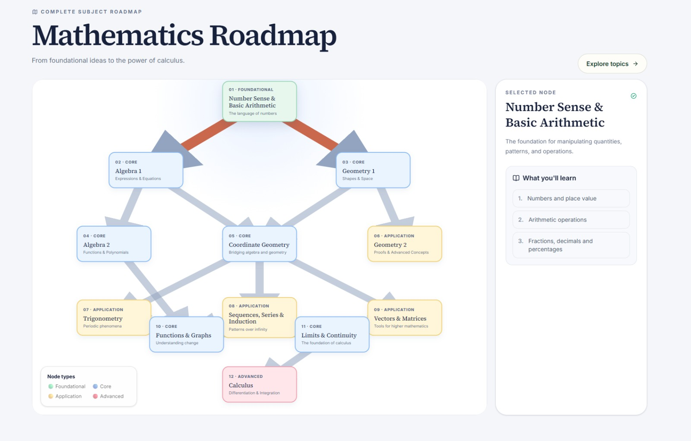
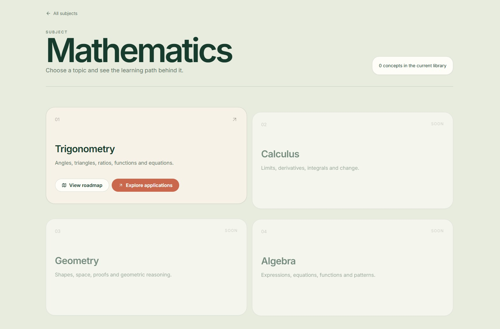
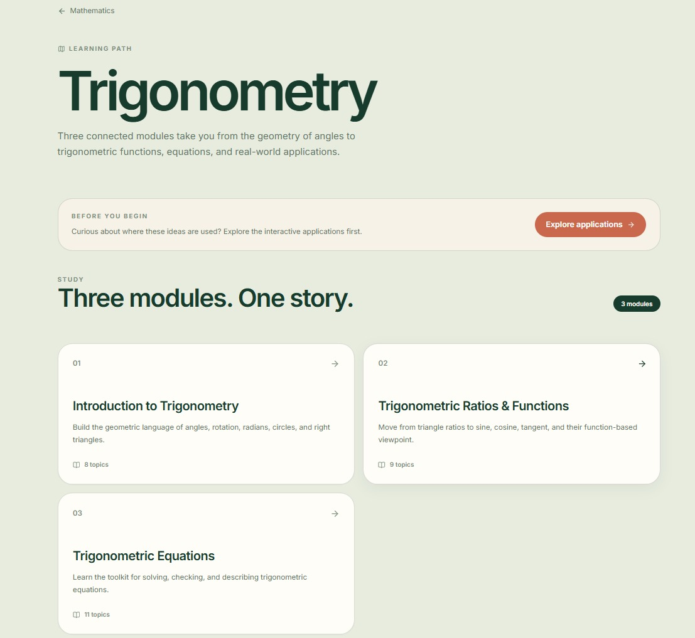
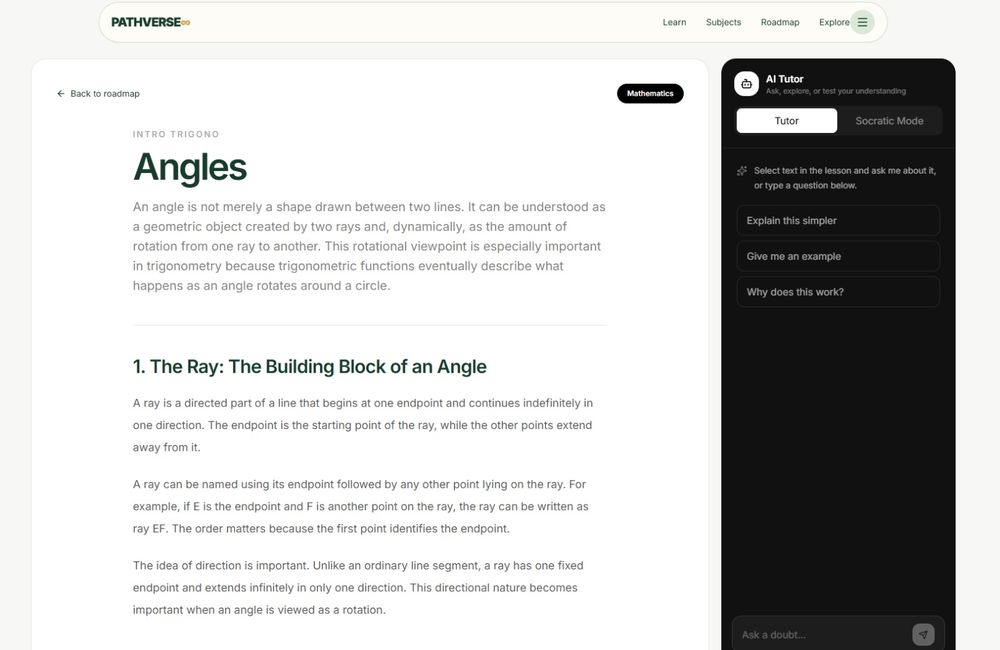
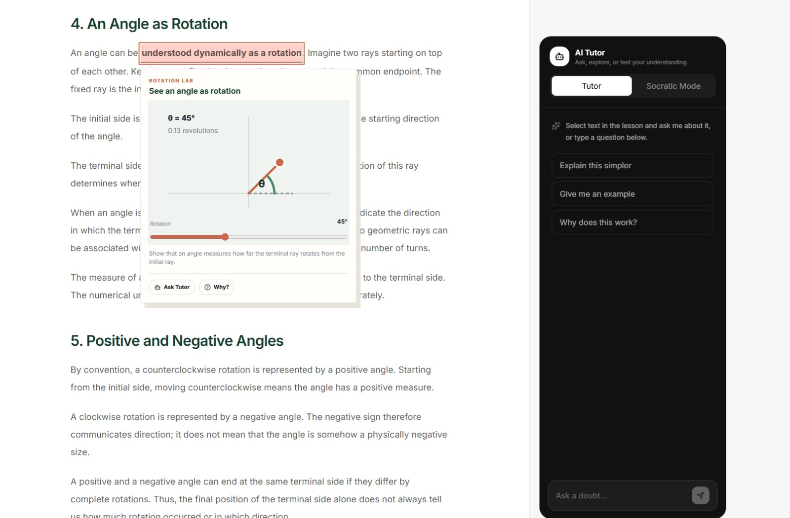
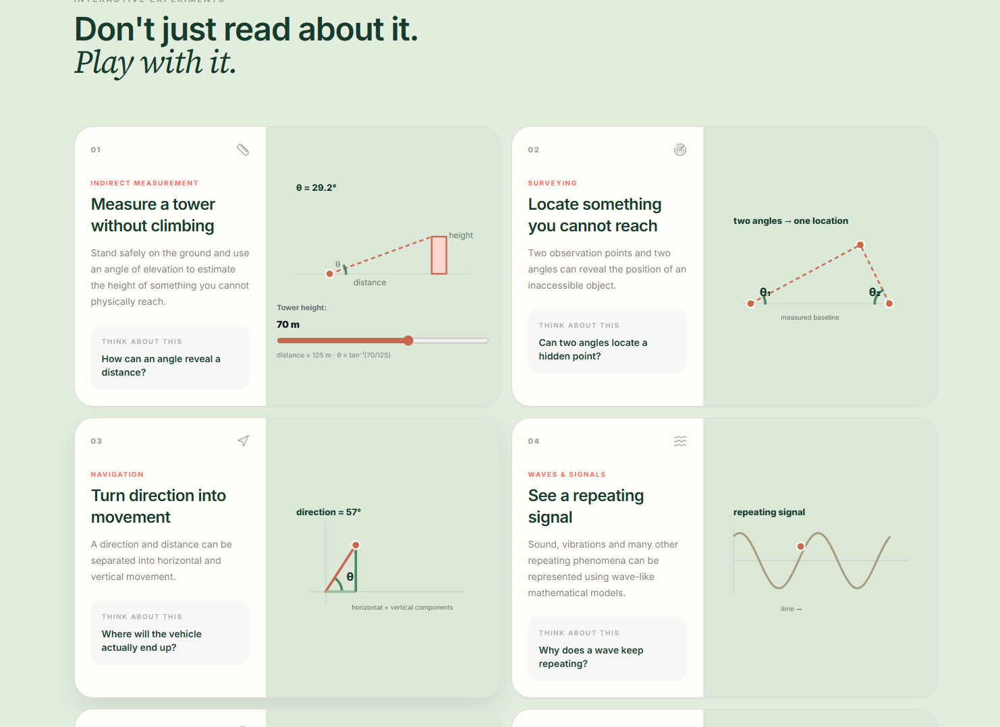
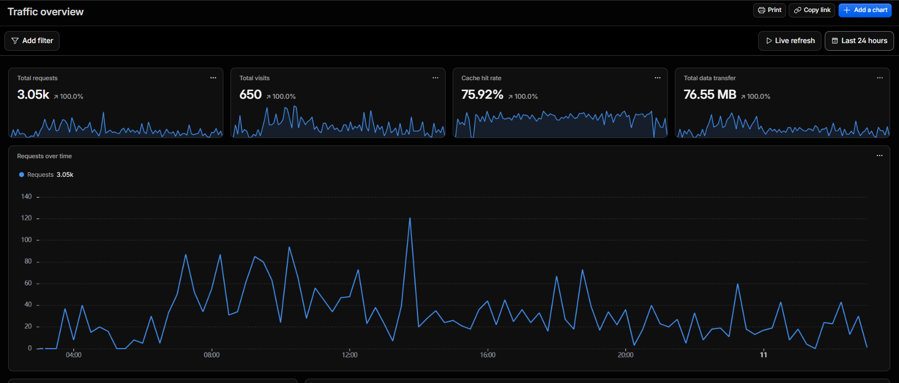

## Team Members

  Name               Role                            Roll Number
  ------------------ ------------------------------- ---------------
  **Varun Verma**    Full Stack --- Team Leader      `2025UCS1685`
  **Devaj Dhawan**   Content Automation              `2025UCA1834`
  **Tanish Verma**   UI Design                       `2025UCA1596`
  **Bhavin Goyal**   Backend & Content Integration   `2025UCA1860`
  **Vansh Mehta**    AI Integration & Animations     `2025UCA1907`
  **Navya Gupta**    PPT, Research & Design          `2025UCS1710`

# PathVerse --- Curiosity → Structured Learning

> **Smart India Hackathon 2026 \| Problem Statement ID: SIH26207 \|
> Theme: Smart Education \| Team: Beyond Why**

PathVerse is an adaptive education platform designed to turn a student's
curiosity into a structured, prerequisite-aware learning journey.
Instead of forcing every learner through the same curriculum, PathVerse
helps identify where the learner is, shows what they should learn next,
and lets them explore concepts through interactive visualizations and an
AI tutor.

The current SIH prototype focuses on **Mathematics**, with an
implemented learning experience around **Trigonometry** and a broader
mathematics roadmap.

## Project Resources

-   **Live Deployed Demo:** https://sih-demo.beyondwhy.workers.dev/
-   **GitHub Repository:**
    https://github.com/devajdhawan30-sketch/Lumina
-   **Demo Video:**
    https://drive.google.com/drive/folders/1tfXmBj0soFcmCgw6oKEyYD7_9fA_8c-i?usp=sharing
-   **SIH 2026 Presentation:** 
    https://drive.google.com/drive/folders/1lDLeAMA09caKhj4aYoOOtIupmM1ND48W?usp=sharing

## Screenshots

Here is a visual overview of the PathVerse platform:

### Landing Page


### Navigation & Roadmaps




### Learning Experience




### Analytics



------------------------------------------------------------------------

## Table of Contents

-   [Problem](#problem)
-   [Solution](#solution)
-   [Key Features](#key-features)
-   [Screenshots](#screenshots) 
-   [How PathVerse Works](#how-pathverse-works)
-   [Technology Stack](#technology-stack)
-   [Architecture](#architecture)
-   [Repository Structure](#repository-structure)
-   [Implemented Prototype](#implemented-prototype)
-   [Getting Started](#getting-started)
-   [Environment Variables](#environment-variables)
-   [API](#api)
-   [Content Model](#content-model)
-   [Deployment](#deployment)
-   [Security](#security)
-   [Project Resources](#project-resources)
-   [Future Scope](#future-scope)
-   [References](#references)

------------------------------------------------------------------------

## Problem

Traditional education commonly follows a fixed, grade-based path. This
creates three major problems:

-   **One-path-fits-all:** learners with different levels of prior
    knowledge are expected to follow the same sequence.
-   **Learning gaps:** missing prerequisites can make advanced concepts
    difficult or confusing.
-   **Curiosity has no path:** students can search for information, but
    search does not provide a structured route from foundational ideas
    to advanced or research-level understanding.

PathVerse is built around the idea that **knowledge is a connected
graph, not a syllabus**.

------------------------------------------------------------------------

## Solution

PathVerse combines a prerequisite-aware knowledge structure with
interactive learning and contextual AI assistance.

### 1. Personalized Learning

The platform is designed to determine what a learner already
understands, identify missing prerequisites, and build an appropriate
learning path.

### 2. Connected Knowledge Graph

Concepts are represented as connected nodes with relationships such as:

-   `prerequisites`
-   `leads_to`
-   `related`

This lets learners move through concepts according to their dependencies
rather than only according to a fixed chapter order.

### 3. Context-Aware AI Tutor

The AI tutor receives the learner's current concept, theory, formulas,
examples, key ideas, misconceptions, and optionally the specific piece
of content they are asking about.

This allows the tutor to answer in the context of the lesson rather than
behaving like a generic chatbot.

### 4. Socratic Mode

PathVerse also provides a Socratic learning mode. Instead of immediately
revealing an answer, the tutor:

-   asks the learner to explain their reasoning,
-   asks one focused question at a time,
-   identifies gaps in reasoning,
-   helps the learner discover the missing connection,
-   provides a grasp assessment when appropriate.

### 5. Curiosity-Driven Exploration

Important parts of lesson content can open interactive visualizations.
The current Trigonometry experience includes visual experiments for
angles, radians, rotation, unit-circle coordinates, sine waves,
similarity, tangent ratios, triangulation, navigation, wave motion,
equation intersections, and measurement applications.

------------------------------------------------------------------------

## Key Features

### Learning & Roadmaps

-   Subject discovery
-   Subject-specific topic organization
-   Graph-style mathematics roadmap
-   Topic/module learning paths
-   Prerequisite, `leads_to`, and related-concept connections
-   Concept difficulty metadata
-   Concept-level lesson navigation
-   Recommended progression through connected concepts

### Interactive Learning

-   Interactive mathematical visualizations
-   Highlighted concepts inside lesson content
-   Exploration popovers
-   Real-world Trigonometry application labs
-   Responsive desktop/mobile interface
-   Motion and page-transition animations

### AI Tutor

-   Context-aware Gemini-powered tutoring
-   Normal Tutor mode
-   Socratic Mode
-   Conversation history
-   Ask Tutor from selected lesson text
-   Concept-specific prompts
-   Grasp assessment in Socratic Mode

------------------------------------------------------------------------

## How PathVerse Works

``` text
                    ┌──────────────────────┐
                    │      Learner         │
                    └──────────┬───────────┘
                               │
                               ▼
                    ┌──────────────────────┐
                    │   Explore Subjects   │
                    └──────────┬───────────┘
                               │
                               ▼
                    ┌──────────────────────┐
                    │  Topic / Roadmap     │
                    │  Prerequisite Graph  │
                    └──────────┬───────────┘
                               │
                               ▼
                    ┌──────────────────────┐
                    │   Concept Lesson     │
                    │ Theory • Formula     │
                    │ Examples • Ideas     │
                    └───────┬───────┬──────┘
                            │       │
                 ┌──────────┘       └──────────┐
                 ▼                             ▼
       ┌──────────────────┐          ┌──────────────────┐
       │ Interactive      │          │ Context-Aware    │
       │ Explorations     │          │ AI Tutor         │
       └──────────────────┘          └────────┬─────────┘
                                              │
                                    ┌─────────┴─────────┐
                                    ▼                   ▼
                              Tutor Mode         Socratic Mode
```

------------------------------------------------------------------------

## Technology Stack

  Layer                  Technology
  ---------------------- -----------------------
  Frontend               React  + TypeScript
  Build Tool             Vite
  Styling                Tailwind CSS
  Animation              Motion + GSAP
  Icons                  Lucide React
  Routing                React Router
  Backend                Hono
  Runtime / Deployment   Cloudflare Workers
  AI                     Google Gemini API
  Content                Structured JSON
  Package Manager        npm

The presentation identifies Gemini API, Hono, Cloudflare, TypeScript,
React, Motion, and Tailwind as core technologies used by the project.
PostgreSQL is identified as part of the broader technical direction,
while the current prototype's content is served from structured files
rather than a PostgreSQL-backed learner database.

------------------------------------------------------------------------

## Architecture

PathVerse uses a React/Vite frontend and a Hono API running on
Cloudflare Workers.

``` text
┌────────────────────────────────────────────────────────────┐
│                         Browser                            │
│                                                            │
│  React + TypeScript + Vite                                 │
│  ├── Landing / onboarding                                  │
│  ├── Subjects                                              │
│  ├── Roadmaps                                              │
│  ├── Topic modules                                         │
│  ├── Concept lessons                                       │
│  ├── Interactive explorations                              │
│  └── AI Tutor / Socratic Mode                              │
└──────────────────────────┬─────────────────────────────────┘
                           │ /api
                           ▼
┌────────────────────────────────────────────────────────────┐
│                 Cloudflare Worker / Hono                   │
│                                                            │
│  /api/health                                               │
│  /api/concepts                                             │
│  /api/subjects                                             │
│  /api/topics                                               │
│  /api/roadmap                                              │
│  /api/ai/chat                                              │
└───────────────┬───────────────────────────────┬────────────┘
                │                               │
                ▼                               ▼
┌──────────────────────────┐        ┌────────────────────────┐
│ Structured Content       │        │ Google Gemini API      │
│                          │        │                        │
│ Concept JSON             │        │ Context-aware Tutor    │
│ Exploration JSON         │        │ Normal / Socratic mode │
│ Source metadata          │        └────────────────────────┘
└──────────────────────────┘
```

### Frontend → Backend

During local development, Vite proxies `/api` requests to the Hono
development server at `http://localhost:8787`.

### Backend → AI

The `/api/ai/chat` endpoint builds a learning context from the requested
concept and sends that context to the Gemini API together with the
conversation history and learner's message.

------------------------------------------------------------------------

## Repository Structure

``` text
SIH_DEMO/
├── README.md
├── IMPLEMENTED_FEATURES.md
├── assets/
│   └── screeshots/
│       ├── ApplicationsVisulizations.png
│       ├── LandingPage.jpeg
│       ├── MainContentPage.jpeg
│       ├── MainContentVisualizations.jpeg
│       ├── RoadMapPage.jpeg
│       ├── SubjectPage.jpeg
│       ├── TopicPage.jpeg
│       └── Traffic24hrs.png
│
├── client/
│   ├── package.json
│   ├── vite.config.ts
│   ├── public/
│   └── src/
│       ├── animations/
│       ├── components/
│       ├── data/
│       ├── pages/
│       ├── services/
│       ├── types/
│       ├── App.tsx
│       ├── App.css
│       └── index.css
│
├── server/
│   ├── package.json
│   ├── index.ts
│   ├── wrangler.jsonc
│   ├── .dev.vars.example
│   ├── routes/
│   │   ├── ai.ts
│   │   ├── concepts.ts
│   │   ├── roadmap.ts
│   │   ├── subjects.ts
│   │   └── topics.ts
│   ├── services/
│   │   ├── content.ts
│   │   └── gemini.ts
│   └── types/
│
└── content/
    ├── concepts/
    │   ├── introduction-to-trigonometry/
    │   ├── trigonometric-ratios/
    │   ├── trigonometricFunctions/
    │   └── applicationOfTrigo/
    ├── explorations/
    │   └── exploration.json
    ├── curriculum/
    │   └── curriculum.json
    └── sources/
        └── sources.json
```

------------------------------------------------------------------------

## Implemented Prototype

The current repository contains a working prototype with the following
implemented areas.

### Mathematics Roadmap

The mathematics roadmap is presented as a graph-style learning
structure. Subject roadmap nodes can open their associated learning
details, and the Trigonometry section is connected to the actual concept
library.

### Trigonometry

The current Trigonometry learning path is divided into three modules:

1.  **Introduction to Trigonometry**
    -   Angles
    -   Angle measurement
    -   Degrees and radians
    -   Angles on a circle
    -   Clock and rotation
    -   Right triangles
    -   Similar triangles
    -   Bridge to trigonometric ratios
2.  **Trigonometric Ratios & Functions**
    -   Trigonometric ratios
    -   Reciprocal trigonometric ratios
    -   Ratios for any angle
    -   Exact trigonometric values
    -   Tangent function
    -   Sine function
    -   Cosine function
    -   Trigonometric functions
    -   Reciprocal trigonometric functions
3.  **Trigonometric Equations**
    -   What are trigonometric equations?
    -   Nature of solutions
    -   Basic equations
    -   Reciprocal-function equations
    -   Factoring
    -   Quadratic trigonometric equations
    -   Identities
    -   Multiple/composite equations
    -   Restricted intervals
    -   Extraneous solutions
    -   General solution

A separate **Applications of Trigonometry** experience provides
interactive experiments based on real-world uses of trigonometry.

### Interactive Explorations

The prototype currently defines interactive visualizations for:

-   Angle rotation
-   Unit circle
-   Sine wave
-   Similar triangles
-   Tower-height measurement
-   One-radian construction
-   Clock rotation
-   Tangent ratio
-   Equation intersections
-   Triangulation
-   Navigation vectors
-   Wave motion
-   Shadow measurement

These explorations can be attached to highlighted portions of lesson
content.

------------------------------------------------------------------------

## Getting Started 

## Deployed Website Link 
https://sih-demo.beyondwhy.workers.dev

### Prerequisites to run locally 

Install:

-   Node.js
-   npm

A Gemini API key is required to use the AI Tutor.

### 1. Clone the Repository

``` bash
git clone https://github.com/devajdhawan30-sketch/PathVerse.git
cd PathVerse/SIH_DEMO
```

### 2. Install Frontend Dependencies

``` bash
cd client
npm install
```

### 3. Install Backend Dependencies

Open a second terminal:

``` bash
cd SIH_DEMO/server
npm install
```

### 4. Configure the Gemini API Key

Create a local development variables file:

``` text
server/.dev.vars
```

Add:

``` env
GEMINI_API_KEY="your-gemini-api-key"
```

Do **not** commit this file.

### 5. Start the Backend

From `SIH_DEMO/server`:

``` bash
npm run dev
```

The Hono/Cloudflare Worker development server runs on the local Wrangler
development port, which the Vite frontend proxies to.

### 6. Start the Frontend

In another terminal, from `SIH_DEMO/client`:

``` bash
npm run dev
```

Open the local URL shown by Vite, typically:

``` text
http://localhost:5173
```

------------------------------------------------------------------------

## Environment Variables

The backend expects:

  -----------------------------------------------------------------------
  Variable                Required                Purpose
  ----------------------- ----------------------- -----------------------
  `GEMINI_API_KEY`        Yes for AI Tutor        Authenticates requests
                                                  to the Google Gemini
                                                  API

  -----------------------------------------------------------------------

A safe template is provided at:

``` text
server/.dev.vars.example
```

Example:

``` env
GEMINI_API_KEY="your-gemini-api-key"
```

------------------------------------------------------------------------

## API

### Health Check

``` http
GET /api/health
```

Returns the backend health status.

### Concepts

``` http
GET /api/concepts
GET /api/concepts/:conceptId
```

Returns all available concepts or a specific concept.

### Subjects

``` http
GET /api/subjects
GET /api/subjects/:subjectId
```

Returns subject-level information and topic groupings.

### Topics

``` http
GET /api/topics
GET /api/topics/:topicId
```

Returns topic metadata and its concepts.

### Roadmaps

``` http
GET /api/roadmap/:topicId
```

Returns the graph for a topic, including nodes and relationships.

### AI Tutor

``` http
POST /api/ai/chat
```

Example request:

``` json
{
  "conceptId": "angles",
  "contentId": "dynamic-angle",
  "mode": "socratic",
  "message": "Why does an angle represent rotation?",
  "history": []
}
```

The endpoint returns:

``` json
{
  "answer": "..."
}
```

------------------------------------------------------------------------

## Content Model

Learning material is stored as structured JSON rather than being
embedded directly in the UI.

A concept contains information such as:

``` text
Concept
├── id
├── title
├── subject
├── topic
├── section
├── difficulty
├── connections
│   ├── prerequisites
│   ├── leads_to
│   └── related
├── theory
├── formulas
├── examples
├── key_ideas
├── misconceptions
├── explorations
└── sources
```

This structure makes it possible for the same learning data to power:

-   lesson rendering,
-   roadmap relationships,
-   interactive exploration triggers,
-   AI Tutor context,
-   examples and formulas,
-   misconceptions,
-   source attribution.

------------------------------------------------------------------------


### Production Prototype

**Deployed prototype:**\
https://sih-demo.beyondwhy.workers.dev/

------------------------------------------------------------------------

## [Download the SIH 2026 Presentation](https://drive.google.com/drive/folders/1lDLeAMA09caKhj4aYoOOtIupmM1ND48W?usp=sharing)

## Future Scope

The current prototype is intentionally focused on demonstrating the core
learning experience. The broader platform can be extended with:

1.  **Learner profiles and persistent progress**
    -   Authentication
    -   Completed concepts
    -   Diagnostic results
    -   Mastery tracking
2.  **Adaptive assessment**
    -   Short diagnostic tests
    -   Dynamic difficulty
    -   Prerequisite skipping when mastery is demonstrated
    -   Targeted revision
3.  **Larger knowledge graph**
    -   More Mathematics branches
    -   Statistics and Geometry
    -   Cross-subject connections
    -   University and research-level pathways
4.  **Automated content pipeline**
    -   Extract educational material from approved sources
    -   Convert it into the structured concept schema
    -   Validate content
    -   Maintain source metadata and licensing information
5.  **Grounded and efficient AI**
    -   Retrieval from verified learning content
    -   Better context selection
    -   Caching and model-use optimization
    -   Stronger safeguards against unsupported explanations
6.  **Analytics and mastery**
    -   Learner progress dashboards
    -   Concept-level mastery
    -   Learning-gap detection
    -   Personalized next-step recommendations

The SIH presentation specifically identifies scalable content creation,
personalized learning, Mentor/Feynman modes, continuous updates,
grounded AI, validation, license-aware sourcing, and AI efficiency as
important directions for making PathVerse practical and scalable.

------------------------------------------------------------------------

## References

### Educational Content Sources

The project presentation identifies the following content sources:

-   OpenStax
-   CK-12
-   MIT OpenCourseWare
-   Wikimedia Commons

### Technical Reference

VanLehn, K. (2011). *The Relative Effectiveness of Human Tutoring,
Intelligent Tutoring Systems, and Other Tutoring Systems.* Educational
Psychologist, 46(4), 197--221.

------------------------------------------------------------------------

## Smart India Hackathon 2026

**Problem Statement ID:** SIH26207\
**Problem Statement:** Student Innovation --- Smart education, a concept
that describes learning in the digital age. It enables learners to learn
more effectively, efficiently, flexibly and comfortably.\
**Theme:** Smart Education\
**Category:** Software\
**Team:** Beyond Why

------------------------------------------------------------------------

